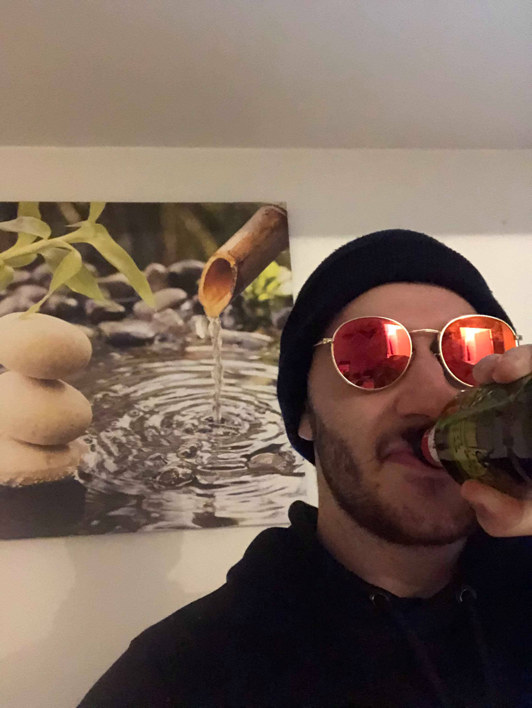

# Paul

[](https://travis-ci.com/luctst/Paul)
[](https://img.shields.io/npm/v/Paul?style=flat-square)
[](https://img.shields.io/bundlephobia/min/Paul)
[](https://david-dm.org/luctst/Paul)
[](https://david-dm.org/luctst/Paul?type=dev)
[](https://github.com/prettier/prettier)
[](https://twitter.com/luctstt)

*Meet Paul at each click*

## Motivation
<p style="text-align:center;width:50%;"></p>

This is my friend Paul, as you can see Paul is a cute guy he loves beer and he works hard everyday..

So I decided to honor him with this little package each time you'll click on a DOM element my friend Paul will appear randomly on your web page :) Enjoy !!

## Usage
Install this package globally if you want have acces to Paul on all your projects:
```js
npm install -g paul
```

If you only want Paul on a specific project enter this:
```js
npm install paul
```

> **Note** - To use paul you need node >=10.0.0

## API


## Licence
MIT

<p style="font-size:8px;text-align:center;margin-top:50px;">File generated with <a href="https://github.com/luctst/get-good-readme">get-good-readme</a> module.</p>
